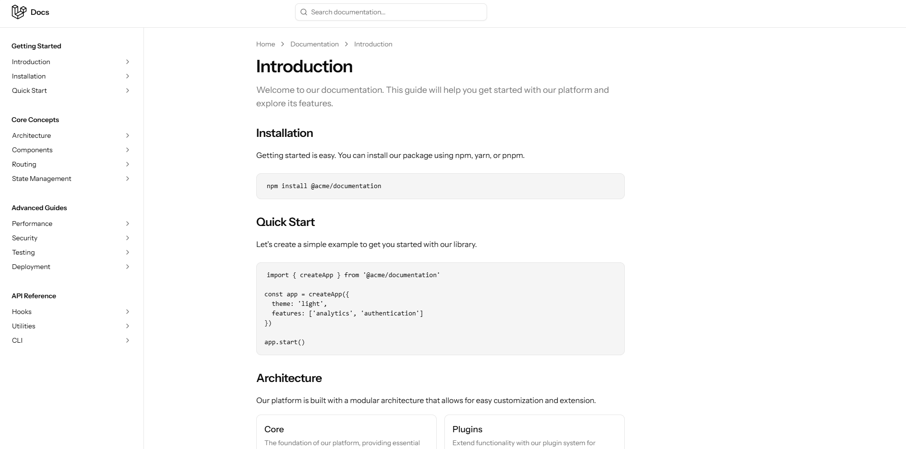

# Laravel Project Setup

## Prerequisites
Make sure you have the following installed on your system:
- **PHP** (>= 8.1)
- **Composer** (latest version)
- **Node.js** (>= 16.x) & **npm** (latest version)
- **MySQL** or **Sqlite** (depending on your database choice)
- **Git**
- **Laravel Installer** (optional, but recommended)

## Installation Steps

### 1.Install dependencies
```bash
composer install
```

### 3. Set Up Environment Variables
```bash
cp .env.example .env
```
- Open `.env` and configure your database settings:
  ```env
  DB_CONNECTION=mysql
  DB_HOST=127.0.0.1
  DB_PORT=3306
  DB_DATABASE=hosphack
  DB_USERNAME=root
  DB_PASSWORD=
  ```

### 4. Generate Application Key
```bash
php artisan key:generate
```

### 5. Run Database Migrations and Seeders (if needed)
```bash
php artisan migrate --seed
```

### 6. Install Frontend Dependencies (if using Laravel Mix or Vite)
```bash
npm install
```

### 7. Compile Frontend Assets (Choose One)
#### If using Laravel Mix:
```bash
npm run dev
```
#### If using Vite:
```bash
npm run build && npm run dev
```

### 8. Start the Local Development Server
```bash
php artisan serve
```

### 9. Queue & Scheduler Setup (Optional, for background jobs)
#### Start the queue worker:
```bash
php artisan queue:work
```
#### Run the scheduler (in a separate terminal):
```bash
php artisan schedule:work
```

### 10. Storage and Permissions (for file uploads)
```bash
php artisan storage:link
chmod -R 775 storage bootstrap/cache
```

## Additional Commands
### Run Tests
```bash
php artisan test
```

### Clear Cache (if needed)
```bash
php artisan cache:clear
php artisan config:clear
php artisan route:clear
php artisan view:clear
```

### Deployment Notes
- Set correct **file permissions** for `storage` and `bootstrap/cache`
- Run `php artisan migrate --force` in production
- Use `npm run build` for optimized frontend assets in production
- Set up supervisor for background jobs
- Configure `.env` properly for production

---
Your Laravel project is now set up and ready to run! 🚀

For more visit the docs 
